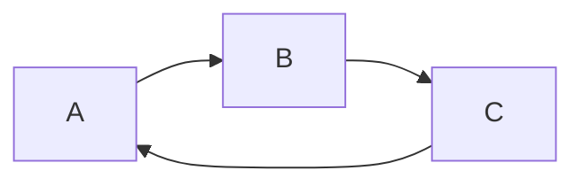

Here’s a **simple usage guide** / quick reference for **Mermaid CLI 11.12.0** (or similar versions). You can use it mainly for **syntax checking** and light rendering.

---

## 🛠️ Installation

If you haven’t installed it yet:

```bash
npm install -g @mermaid-js/mermaid-cli
```

This gives you the `mmdc` command (Mermaid CLI). ([GitHub][1])

---

## ✅ Basic Commands & Use Cases

Here are the most useful commands you'll likely use when checking / rendering diagrams.

| Purpose                                                  | Command                                                 | Notes                                                                          |
| -------------------------------------------------------- | ------------------------------------------------------- | ------------------------------------------------------------------------------ |
| **Render a Mermaid file to SVG (or other formats)**      | `mmdc -i input.mmd -o output.svg`                       | `-i` = input, `-o` = output                                                    |
| **Specify output format explicitly**                     | `mmdc -i file.mmd -o file.png -t neutral`               | Default format is SVG; you can output PNG, PDF, etc.                           |
| **Check syntax / test diagram without actual rendering** | `mmdc --validate -i file.mmd`                           | Only checks if the syntax is valid, reports errors if any                      |
| **Use a custom theme**                                   | `mmdc -i input.mmd -o output.svg -t forest`             | Use one of the built-in themes (e.g. “default”, “forest”, “forest-dark”, etc.) |
| **Adjust width / height / scale**                        | `mmdc -i file.mmd -o file.svg --width 800 --height 600` | You can also control scale                                                     |
| **Set configuration file**                               | `mmdc -c config.json -i input.mmd -o output.svg`        | Use JSON config to override defaults                                           |

---

## 🔍 Focus on Syntax Validation

If your main use is to **check if your Mermaid code is valid**, the key is:

```bash
mmdc --validate -i yourDiagramFile.mmd
```

* If the syntax is correct, it should exit (with status code 0) and not show errors.
* If there are syntax errors, it will print error messages pointing to lines, etc.
* You can combine with `-c` to apply certain configurations during validation.

---

## 📎 Example Walkthrough

Suppose you have a file `diagram.mmd`:



* To check syntax:

  ```bash
  mmdc --validate -i diagram.mmd
  ```

* To render it to SVG:

  ```bash
  mmdc -i diagram.mmd -o diagram.svg
  ```

* To render PNG instead:

  ```bash
  mmdc -i diagram.mmd -o diagram.png
  ```

* To render with a theme and fixed size:

  ```bash
  mmdc -i diagram.mmd -o diagram.svg -t forest --width 800 --height 600
  ```

---

If you like, I can also generate a one-page cheatsheet PDF you can keep as reference. Do you want me to make that for you?

[1]: https://github.com/mermaid-js/mermaid-cli?utm_source=chatgpt.com "mermaid-js/mermaid-cli: Command line tool for the Mermaid library"
